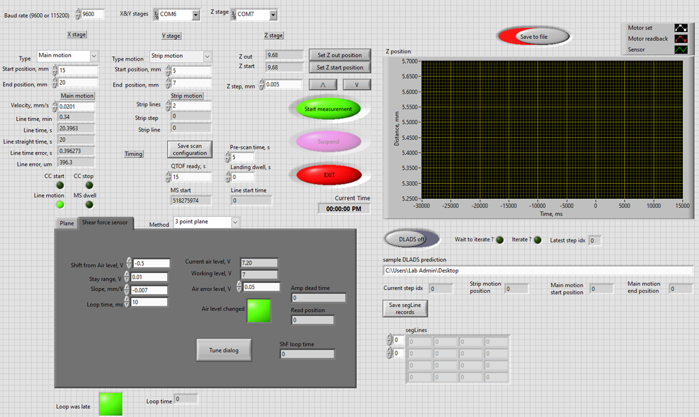

# nano-DESI-stage-dynamic-sampling
It is a LabVIEW based software for running nano-DESI mass spectrometry imaging experiments. It includes the function to control the tissue sample stage height by shear force microscopy. It also provides a working mode to do dynamic line sampling in coordination with DLADS program. 

